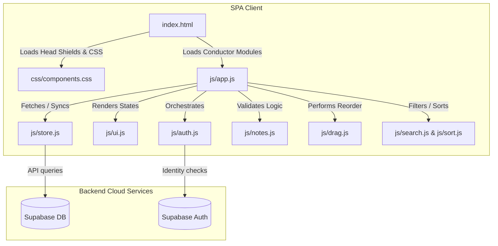

# 📝 NoteFlow — Premium Personal Workspace

NoteFlow is a lightweight, responsive, and secure **Single Page Application (SPA)** designed for frictionless note-taking. Combining modern, soft-minimalist flat-tactile design with offline-first capabilities, NoteFlow offers a premium personal workspace that protects your thoughts and syncs them seamlessly.

---

## 🛠️ The Tech Stack

NoteFlow is built using pure, native web standards and top-tier cloud infrastructure to deliver lightning-fast performances and zero-dependency footprints.

| Technology | Logo | Description |
| :--- | :---: | :--- |
| **HTML5** |  | Semantic structure, accessibility shields, and native modal overlay systems. |
| **CSS3** |  | Custom design system variables, dark/light theme tokens, and custom animation curves. |
| **JavaScript (ES6+)** |  | Native ES modules, async/await flow controls, event-driven state orchestration, and debounced auto-saves. |
| **Supabase** |  | Secure GoTrue user authentication, PostgreSQL note database synchronization, and local session management. |
| **Google Fonts** |  | Premium typefaces (*Inter* family) and sleek material vector symbols for tactile navigation. |

---

## ✨ Features

- 🚀 **Zero-Flash Hash Routing (`/#/` & `/#/auth`)** — A fully unified Single Page Application (SPA) that hides all `.html` extensions. Synchronous gatekeepers run in `<head>` to immediately intercept and redirect unauthenticated routes before the browser renders the page.
- 🎨 **Soft-Minimalist Tactile UI** — A premium, modern dashboard loaded with custom radial gradients, elevation shadows, glassmorphism overlays, responsive mobile panels, and smooth scale animations on clicks.
- 🔄 **Real-Time Database Sync** — Fully integrated Supabase PostgreSQL cloud sync with robust offline safeguards, so your notes are secure and accessible anywhere.
- ⏳ **Autosave Engine** — Automatically saves your title and body changes 500ms after you stop typing (utilizing custom debouncing) — no "Save" buttons needed.
- 📍 **Organizational Hierarchy** — Drag-and-drop notes to create a custom manual order, pin important notes to the top of your feed, or search titles and bodies in real-time.
- 📥 **Backup & Portability** — Export your workspace workspace as a text file or JSON backup, or restore previous files instantly.

---

## 📐 Project Architecture

NoteFlow follows the **Separation of Concerns (SoC)** principle, separating page layout, UI rendering, logic layers, and storage gateways into clear modules:



### File Responsibilities

- **`index.html`** — The single structural layout holding both the authentication card overlay and the dashboard containers, protected by synchronous router script shields.
- **`css/`**
  - `reset.css` — Standardizes browser differences.
  - `themes.css` — Stores CSS custom property design system variables (colors, fonts, radii).
  - `layout.css` — Manages responsive dual-panel desktop and stackable mobile grid view rules.
  - `components.css` — Houses individual component definitions (cards, spinners, modials, toast notifications, premium loaders).
  - `auth.css` — Handles auth layouts and sets identical typographic rules.
- **`js/`**
  - `app.js` — The main conductor. Houses the central hash router, swaps layouts, binds single-instance events, and triggers UI updates.
  - `auth.js` — Manages login/signup credentials, modes, feedback loops, and exports SPA mounting triggers.
  - `store.js` — The storage gateway. Controls database calls to Supabase and manages offline try/catch session fallbacks.
  - `notes.js` — Performs clean, side-effect-free updates, pinning logic, and preview truncation.
  - `ui.js` — Handles DOM injection, markdown editing views, toasts, and animations.
  - `utils.js`, `search.js`, `sort.js`, `drag.js` — General functional helper utility libraries.

---

## 🚀 Quick Setup & Installation

Since NoteFlow is a client-side vanilla JavaScript app, it runs instantly on any server without requiring compilation or npm installation.

### 1. Configure Supabase Credentials
Open [js/config.js](file:///Users/kefamgaya/Documents/kepha14.dev/MyProject/js/config.js) and configure your Supabase URL and Anon key:
```javascript
export const supabaseUrl = 'YOUR_SUPABASE_URL';
export const supabaseAnonKey = 'YOUR_SUPABASE_ANON_KEY';
```

### 2. Set Up Database Schema
Run the SQL definitions located in [schema.sql](file:///Users/kefamgaya/Documents/kepha14.dev/MyProject/schema.sql) directly inside your Supabase SQL Editor. This will configure the `notes` table with its relational user foreign key, automated updated timestamp triggers, and row-level security (RLS) policies.

### 3. Launch Locally
Start a lightweight local server from the project directory:

**Using Node.js (`http-server`):**
```bash
npx http-server ./
```

**Using Python:**
```bash
python3 -m http.server 8000
```

Now open `http://localhost:8000` (or the port specified by your server) to experience NoteFlow!
